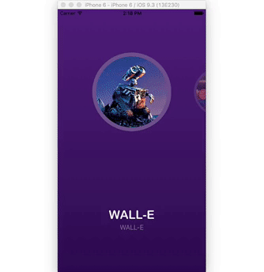
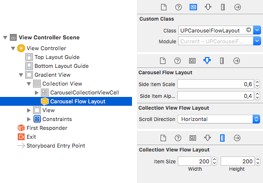

UPCarouselFlowLayout
===============

`UPCarouselFlowLayout` is a fancy carousel flow layout for `UICollectionView`. It comes with a paginated effect and it shrinks and makes transparent the side items.



## Requirements

- iOS 8.1+

## Installation

### CocoaPods

`UPCarouselFlowLayout` is available through [CocoaPods](http://cocoapods.org). To install
it, simply add the following line to your Podfile:

```
pod "UPCarouselFlowLayout"
```

### Carthage

Users can simply add to their Cartfile:

```
github "ink-spot/UPCarouselFlowLayout"
```

### Manual

Simply copy the folder `UPCarouselFlowLayout` to your project and import it in XCode.

## Usage

### Getting Started

##### Via code

```swift
import UPCarouselFlowLayout
```

Create a `UPCarouselFlowLayout` object, set its `itemSize` and assign it to your `UICollectionView`.

```swift
let layout = UPCarouselFlowLayout()
layout.itemSize = CGSizeMake(200, 200)
collectionView.collectionViewLayout = layout
```

##### Via Interface Builder

Set the `UICollectionView` layout class to `UPCarouselFlowLayout`, and set its `itemSize` and its properties.



### Properties

`UPCarouselFlowLayout` has a few customizable properties:

* `sideItemScale` (between 0 and 1, default is 0.6)
*Can be set through code or via Interface Builder.*
The shrinking ratio for collection items which are not in the center.

* `sideItemAlpha` (between 0 and 1, default is 0.6)
*Can be set through code or via Interface Builder.*
The opacity ratio for collection items which are not in the center.

* `sideItemShift` (value in pixels, default is 0)
*Can be set through code or via Interface Builder.*
A vertical/horizontal offset (depending on the collectionView scroll direction) for collection items which are not in the center.

* `spacingMode` (default is fixed spacing of 40 pts)
*Can be set only through code.*
  * `UPCarouselFlowLayoutSpacingMode.fixed(spacing: CGFloat)`
Items in the carousel are positioned with a fixed space between them.
  * `UPCarouselFlowLayoutSpacingMode.overlap(visibleOffset: CGFloat)`
A fixed part of the side items are visible on the sides of the collection (and therefore the space between items depends on the collection size).


## License

`UPCarouselFlowLayout` is released under the MIT license.
See [LICENSE](./LICENSE) for details.
